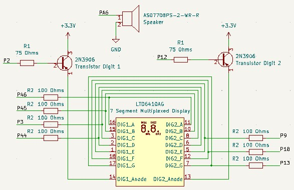
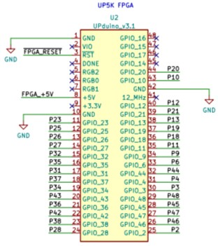
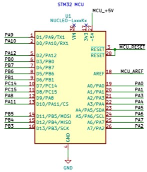
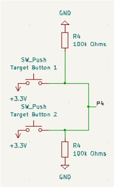
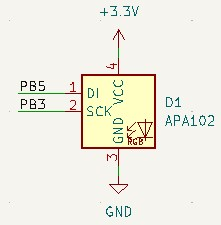

# Schematics
<!-- Include images of the schematics for your system. They should follow best practices for schematic drawings with all parts and pins clearly labeled. You may draw your schematics either with a software tool or neatly by hand. -->

  

IR Photodiode Sensors & IR LED Circuit (Tunnel & Lose)

  

FSM Reset & Enable Circuit

  

Speaker & Multiplexed Display Circuit

  

Field-Programmable Gate Array (FPGA)

  

Microcontroller (MCU)

  

Target Buttons Circuit

  

Addressable SPI Peripheral LED Strip Circuit

# Source Code Overview
<!-- This section should include information to describe the organization of the code base and highlight how the code connects. -->

The source code for the project is located in the Github repository [here](https://github.com/CristianGo23/E155-FA22-Final-Project/tree/main/src).

# Bill of Materials
<!-- The bill of materials should include all the parts used in your project along with the prices and links.  -->

| Item | Part Number | Quantity | Unit Price | Link |
| ---- | ----------- | ----- | ---- | ---- |
| x6 Pack Arcade Rectangle LED Push Buttons Switch for Arcade Machine Games |  B07R8CNW47 | 1 | $14.99 |  [link]([https://www.adafruit.com/product/3317](https://www.amazon.com/EG-STARTS-Rectangle-Buttons-Machine/dp/B07R8CNW47/ref=asc_df_B07R8CNW47/?tag=hyprod-20&linkCode=df0&hvadid=343203947175&hvpos=&hvnetw=g&hvrand=12031087723008928438&hvpone=&hvptwo=&hvqmt=&hvdev=c&hvdvcmdl=&hvlocint=&hvlocphy=9031250&hvtargid=pla-782060310431&psc=1&tag=&ref=&adgrpid=66485480342&hvpone=&hvptwo=&hvadid=343203947175&hvpos=&hvnetw=g&hvrand=12031087723008928438&hvqmt=&hvdev=c&hvdvcmdl=&hvlocint=&hvlocphy=9031250&hvtargid=pla-782060310431)) |
| OP950 IR Photodiode |  365-1085-ND | 10 | $.74 |  [link]([https://www.adafruit.com/product/3317](https://www.digikey.com/en/products/detail/tt-electronics-optek-technology/OP950/498711?s=N4IgTCBcDaIPIAUCcBWADCAugXyA)) |
| IR1503 Infrared Emitter 940nm  |  1080-1071-ND | 10 | $0.46 |  [link](https://www.digikey.com/en/products/detail/everlight-electronics-co-ltd/IR1503/2675562) |
| APA102 SPI Addressable LED RGB Strip |  14015 | 1 | $17.50 |  [link]([https://www.adafruit.com/product/3317](https://www.sparkfun.com/products/14015)) |
| MDF | n/a | 6sqft | $0.00 | Inherited from Alumni |
| 3D Printer PLA Filament Prints | n/a | 4 | $0.00 | Mudd Makerspace |
| Multiplexed Seven Segment Display | n/a | 1 | $0.00 | ENGR155 Lab |
| 8 Ohm 4 W Speaker | n/a | 1 | $0.00 | ENGR155 Lab |
| MarkForged Carbon Fiber Print | n/a | 1 | $15.26 | Mudd Makerspace |

**Total cost: $55.61**
